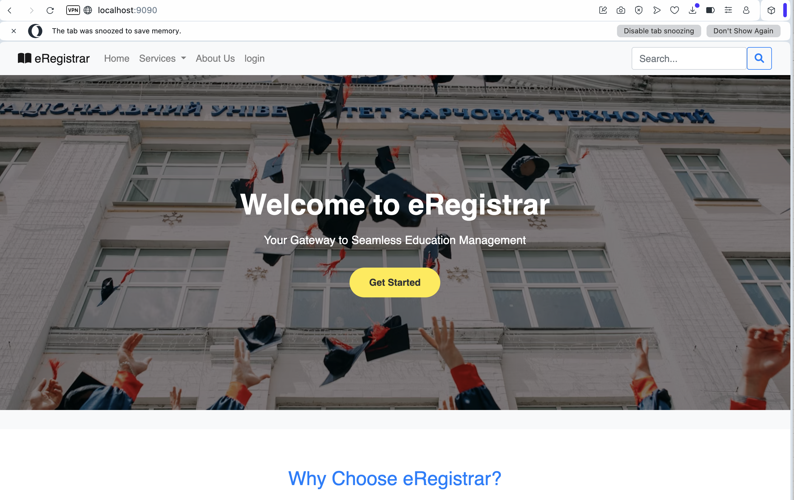

# eRegistrar

 eRegistrar is an online Student Registration system for a University built using Spring Boot, Thymeleaf, and Spring Data JPA. This application allows users to manage student registrations, including viewing, adding, editing, and deleting student information.

# Features

 - Display a homepage with navigation links.
 - List all registered students in a table.
 - Register new students through a user-friendly form.
 - Edit existing student registration data.
 - Delete student records.
 - Search for students by name.

# Technologies Used

 - Spring Boot
 - Spring Web MVC
 - Thymeleaf
 - Spring Data JPA
 - MySQL

# Installation

 1. **Clone the repository:**

    ```bash
    git clone https://github.com/vmercel/lab10.git
    ```

 2. **Navigate to the project directory:**

    ```bash
    cd eregistrar
    ```

 3. **Configure the database:**
    - Update the `application.properties` file with your MySQL database credentials.

 4. **Run the application:**

    ```bash
   ./mvnw spring-boot:run
    ```

5. **Access the application:**
    - Open your web browser and navigate to `http://localhost:8080/`.

# Usage

 - To register a new student, click on the "Register" link.
- To view the list of students, click on the "Student List" link.
- Use the search functionality to find specific students.

# Screenshots

### Use Case


### Class Diagram


### IDE


### Landing Page


### Login Page


### Register Page


### Add Student


### Student List


# Contributing

 Contributions are welcome! Please open an issue or submit a pull request.

# License

# This project is licensed under the MIT License - see the [LICENSE](LICENSE) file for details.